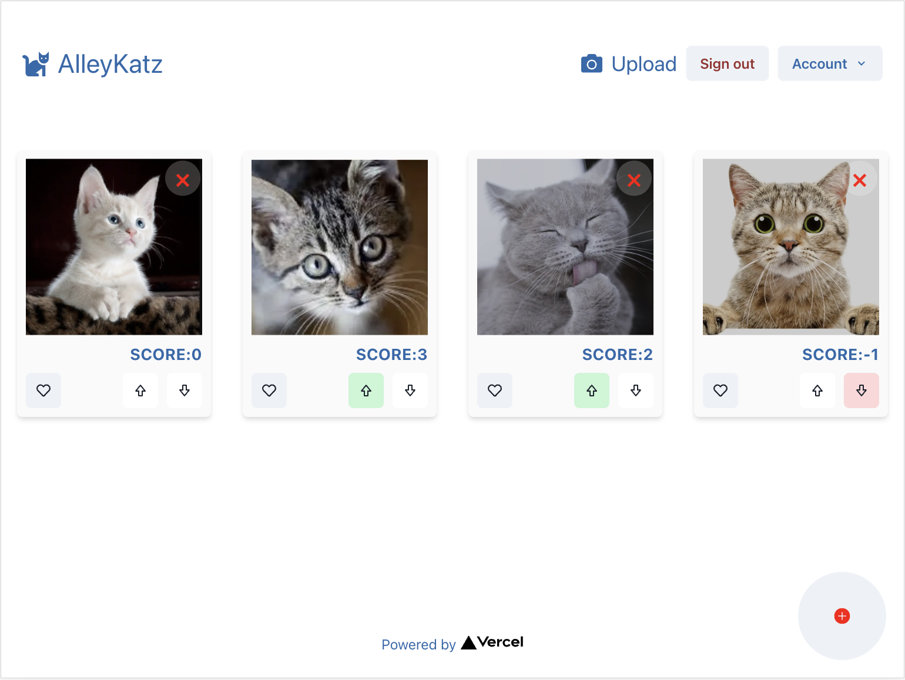

# AlleyKatz 🐱
- An image gallery of cats that, when signed in, you can 'like', vote for/against, and upload
- You can only delete your own cats 🗑️


## Getting Started 🚀

### Deployed Version 💻 

- Available on Vercel (will provide the URL via email. Any problems logging in, give me a shout!)
### Running locally 🏗️

- You'll need some env variables to get running:
```
SECRET_API_KEY= // ask me for this
GITHUB_ID= // available via GitHub App
GITHUB_SECRET= // ditto
SECRET_PASSWORD= // for faking a login
```

`npm run dev`
Open [http://localhost:3000](http://localhost:3000) with your browser to see the result.


